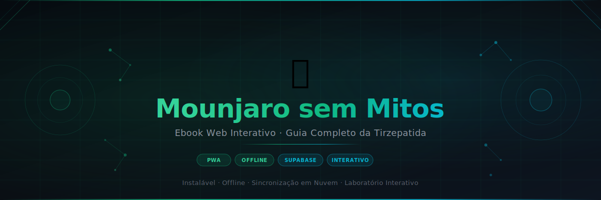
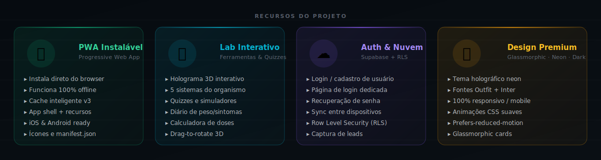
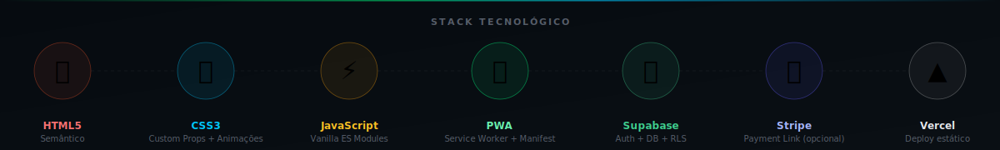

<div align="center">



<br/>

[](https://ebook-interativo-fawn.vercel.app)
[](https://ebook-interativo-fawn.vercel.app)
[](https://supabase.com)
[](https://ebook-interativo-fawn.vercel.app)

</div>

---

## Sobre o Projeto

**Mounjaro sem Mitos** é um guia interativo, educativo e **não-prescritivo** sobre a tirzepatida (Mounjaro), voltado a quem quer entender o tratamento com **mais segurança, menos medo e expectativas realistas**. Desenvolvido como Progressive Web App (PWA) instalável, funciona offline, traz um laboratório interativo (modelo anatômico, quizzes, diários) e integração opcional com Supabase + Stripe.

> Conteúdo educativo — não substitui avaliação médica, não orienta dose, compra ou uso.

---

## Funcionalidades



### Conteúdo
- **23 capítulos** cobrindo mecanismo de ação, indicações aprovadas/em estudo, benefícios, riscos, sinais de alerta, contraindicações, interações, comparação com outros fármacos, estudos clínicos (SURPASS/SURMOUNT/SUMMIT/SYNERGY-NASH), nutrição, linha do tempo do tratamento, manutenção/reganho, custo & acesso, mitos e perguntas para o médico
- **Disclaimer educativo fixo** e linguagem não-prescritiva em todo o material
- **Glossário interativo** com termos médicos e científicos
- **Narrador de capítulos** (Web Speech API) e **agente de voz** opcional (OpenAI Realtime, com chave do próprio usuário)
- Progresso de leitura salvo automaticamente (localStorage + nuvem)
- Navegação entre capítulos com barra de progresso global

### Laboratório Interativo
- **Modelo anatômico interativo** com **7 sistemas** do organismo (girar/arrastar + hotspots clicáveis)
- **Quizzes** de fixação com feedback imediato e resumo de aprendizado
- **Calculadora de IMC/TMB** e **checklist de triagem** (educativo, sem liberar uso)
- **Comparador** de medicamentos e tabela de efeitos colaterais
- **Simulador de aplicação** da caneta KwikPen (mecanismo, **sem seleção de dose**)
- **Diário de peso e sintomas** com gráficos de evolução (Chart.js)
- Medidor de exploração e sistema de conquistas

### Painel, Exportação & Ajuda
- **Painel do leitor** com saudação, data, progresso e sugestões
- **Baixar / compartilhar PDF** de qualquer capítulo (jsPDF + Web Share API)
- **Área de ajuda** com e-mail, telefone e WhatsApp

### PWA & Offline
- Instalável no celular e desktop (Android, iOS, Windows, macOS)
- Funciona sem internet após o primeiro acesso
- Service Worker com cache inteligente (app shell + conteúdo)
- Atualização automática em segundo plano

### Auth & Sincronização (Supabase)
- Cadastro e login por e-mail/senha
- Recuperação de senha por e-mail
- Sincronização do progresso entre dispositivos
- Captura de leads (newsletter)
- Row Level Security (RLS) — cada usuário acessa apenas seus próprios dados

### Privacidade
- **Política de Privacidade** (LGPD) em [`/privacidade.html`](https://ebook-interativo-fawn.vercel.app/privacidade.html)
- Botão **"Limpar meus dados deste dispositivo"** (apaga progresso, diários, nome e chave de voz do navegador)
- Aviso transparente de que a chave da OpenAI fica apenas no navegador

---

## Stack Tecnológico



| Camada | Tecnologia | Detalhes |
|--------|-----------|---------|
| Frontend | HTML5 + CSS3 + JS | Vanilla, sem bundler, ES Modules |
| Design | CSS Custom Properties | Tema dark neon (#00E676 / #00C8FF) |
| Fontes | Outfit + Inter | Google Fonts |
| PWA | Service Worker + Manifest | Cache versionado, offline-first |
| Gráficos / PDF | Chart.js + jsPDF | Hospedados localmente (`js/vendor/`) |
| Voz | Web Speech API + OpenAI Realtime | Narrador + agente de voz (chave do usuário) |
| Backend | Supabase | Auth, PostgreSQL, RLS |
| Pagamentos | Stripe | Payment Link (sem backend) |
| Deploy | Vercel | CDN global, deploy estático |

---

## Estrutura do Projeto

```
ebook-interativo/
├── index.html              # Shell do app (PWA)
├── login.html              # Página de login/cadastro dedicada
├── privacidade.html        # Política de Privacidade (LGPD)
├── manifest.json           # Configuração PWA
├── service-worker.js       # Cache offline (app shell)
│
├── js/
│   ├── config.js           # Configuração das integrações (Supabase/Stripe/OpenAI)
│   ├── data.js             # Conteúdo do ebook (capítulos, quiz, glossário)
│   ├── app.js              # Controlador da interface, laboratório, PDF e painel
│   ├── integrations.js     # Auth, sync, leads e paywall (ES module)
│   ├── voice-agent.js      # Agente de voz (OpenAI Realtime, opcional)
│   └── vendor/
│       ├── chart.umd.min.js  # Chart.js (gráficos dos diários)
│       └── jspdf.umd.min.js  # jsPDF (exportar/compartilhar PDF)
│
├── css/
│   ├── main.css            # Sistema de design (variáveis, layout, tipografia)
│   ├── components.css      # Componentes (cards, mapa corporal, lab, painel, PDF)
│   └── auth-gateway.css    # Gateway de autenticação integrado
│
├── assets/
│   ├── icons/              # Ícones PWA (192, 512, maskable, apple-touch)
│   ├── images/             # Imagens do ebook + body_map.svg (modelo anatômico)
│   └── videos/             # Vídeos próprios (opcional)
│
├── supabase/
│   ├── schema.sql          # Tabelas + RLS (profiles, user_state, leads, purchases)
│   └── functions/
│       └── stripe-webhook/ # Edge Function: webhook do Stripe → libera acesso
│
└── docs/
    ├── banner.svg          # Banner do README
    ├── features.svg        # Features do README
    ├── tech-stack.svg      # Tech stack do README
    ├── INTEGRACOES.md      # Guia de configuração Supabase + Stripe
    └── estrutura_completa_ebook_mounjaro_sem_mitos.md
```

---

## Rodar Localmente

Por ser um site 100% estático, basta servir a pasta com qualquer servidor HTTP:

```bash
# Python (nativo)
python3 -m http.server 8080

# Node.js
npx serve .

# VS Code: extensão Live Server
```

Acesse: `http://localhost:8080`

> **Sem configuração adicional necessária.** O ebook funciona completamente sem Supabase ou Stripe — progresso e diários ficam no localStorage.

---

## Configurar Integrações (Opcional)

### Supabase (Auth + Sincronização)

1. Crie um projeto em [supabase.com](https://supabase.com)
2. Rode o SQL em `supabase/schema.sql` no Editor SQL do Supabase
3. Ative o provider **Email** em Authentication → Providers
4. Edite `js/config.js`:

```javascript
window.APP_CONFIG = {
  supabase: {
    url: 'https://SEU-PROJETO.supabase.co',
    anonKey: 'sb_publishable_...'   // chave pública anon — segura no browser
  },
  // ...
};
```

### Stripe (Acesso Pago — opcional)

1. Crie um **Payment Link** no Stripe Dashboard
2. Em `js/config.js`, preencha:

```javascript
stripe: {
  paymentLink: 'https://buy.stripe.com/xxxxxxxx',
  priceLabel: 'R$ 49,90'
},
premiumChapters: ['capitulo-10', 'capitulo-11', 'capitulo-12']
```

3. Configure o webhook do Stripe apontando para a Edge Function em `supabase/functions/stripe-webhook/`

> Guia completo em [`docs/INTEGRACOES.md`](docs/INTEGRACOES.md)

---

## Login / Auth

A página de login está em [`/login.html`](https://ebook-interativo-fawn.vercel.app/login.html):

- **Entrar** — login com e-mail e senha
- **Criar conta** — cadastro com confirmação de senha
- **Recuperar senha** — link de redefinição por e-mail
- Redireciona automaticamente se já houver sessão ativa
- Design holográfico consistente com o tema do ebook

---

## Segurança

- **Apenas chaves públicas** no frontend (`anonKey` / `publishableKey`) — nunca chaves secretas
- **Row Level Security** ativo em todas as tabelas — usuário só acessa seus próprios dados
- **CSP** restritiva no `index.html`, `login.html` e `privacidade.html` — whitelist de domínios externos
- Gravação em `purchases` feita exclusivamente pela Edge Function com `service_role` (nunca pelo browser)
- A chave da OpenAI (agente de voz) fica **apenas no navegador** do usuário e nunca é enviada ao servidor
- **Privacidade/LGPD:** Política de Privacidade dedicada + opção de apagar os dados locais a qualquer momento

> **Conteúdo médico:** material educativo, não-prescritivo. Antes de publicar, recomenda-se revisão por profissional de saúde habilitado e preenchimento dos dados do responsável na Política de Privacidade.

---

## Licença

Desenvolvido para fins informativos e educativos.  
Conteúdo médico meramente informativo — consulte sempre um profissional de saúde.

---

<div align="center">
  <sub>Mounjaro sem Mitos © 2026 · Feito com ❤️ e muita tirzepatida</sub>
</div>
